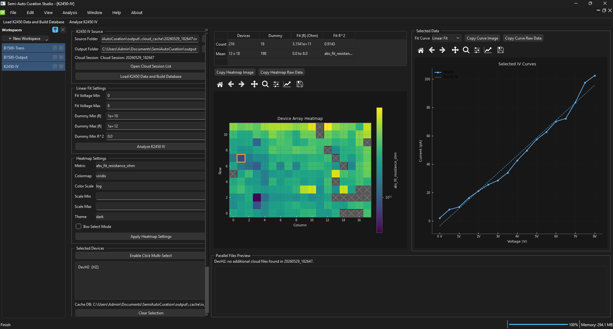

# Semi-Auto Curation Studio

<p align="center">
  <strong>A desktop workbench for semi-automated curation, visualization, and export of high-throughput electrical characterization data.</strong>
</p>

<p align="center">
  <a href="https://www.python.org/"></a>
  <a href="https://doc.qt.io/qtforpython-6/"></a>
  <a href="https://docs.astral.sh/uv/"></a>
  
  
</p>

<p align="center">
  <a href="#overview">Overview</a> |
  <a href="#preview">Preview</a> |
  <a href="#features">Features</a> |
  <a href="#workspaces">Workspaces</a> |
  <a href="#quick-start">Quick Start</a> |
  <a href="#data-and-outputs">Data & Outputs</a> |
  <a href="#architecture">Architecture</a>
</p>

## Overview

Semi-Auto Curation Studio is a Python desktop application for researchers working with automated probe-station and device-array measurements. It helps transform raw measurement folders into structured device metrics, heatmaps, curve previews, and exportable result files.

The application is built as a multi-workspace Qt workbench. Users can open IV, B1500 transfer/output, image-analysis, and custom-script panels side by side, making it easier to compare datasets, inspect outliers, and prepare clean analysis outputs without switching between separate tools.

## Preview

<p align="center">
  
  <br>
  <em>Screenshot placeholder: main workbench with the Workspaces dock, active analysis window, heatmap, curve viewer, and selected-device details.</em>
</p>

<p align="center">
  
  <br>
  <em>Screenshot placeholder: annotated interface layout showing the dock, toolbar, MDI workspace, heatmap, curve panel, and status bar.</em>
</p>

## Features

| Area | Capability |
| --- | --- |
| Workbench UI | Multi-document desktop interface with docked workspace navigation, toolbar commands, status/progress display, and tile/cascade window arrangement. |
| Analysis | K2450 IV fitting, B1500 transfer/output metric extraction, image-derived device metrics, and custom Python script execution. |
| Visualization | Device-array heatmaps, selectable cells, multi-device curve previews, linear/log scale options, colormap controls, and light/dark themes. |
| Curation | Dummy-device classification, selected-device inspection, metadata-aware array positioning, and cloud/local source workflows. |
| Export | CSV and JSON exports for summaries, detailed per-device records, and downstream plotting or reporting. |
| Extensibility | Analyzer registry pattern for adding new workspace types without rewriting the main application shell. |

## Workspaces

### K2450-IV

<p align="center">
  
  <br>
  <em>Screenshot placeholder: K2450-IV analysis with resistance heatmap and selected raw IV curves.</em>
</p>

The `K2450-IV` workspace loads IV sweep files, builds a local cache database, applies a configurable linear-fit voltage window, and extracts resistance/current metrics for each device in an array.

Key outputs:

- `iv_fit_summary.csv`
- `iv_fit_detail.json`

### B1500 Transfer And Output

<p align="center">
  
  <br>
  <em>Screenshot placeholder: B1500 transfer/output workspace with metric heatmap and multi-curve preview.</em>
</p>

The B1500 workspaces separate transfer and output analysis while sharing a common review pattern: select a source, compute device-level metrics, inspect heatmaps, and review selected curves.

Transfer metrics include on/off current, transconductance, subthreshold swing, leakage, and threshold-voltage estimates. Output metrics include current, resistance, output conductance, saturation behavior, lambda, Early voltage, and knee voltage.

Key outputs:

- `b1500_transfer_summary.csv`
- `b1500_transfer_detail.json`
- `b1500_output_summary.csv`
- `b1500_output_detail.json`

### Image Analysis And Custom Scripts

The `Image Analysis` workspace provides image-derived metrics and selected-device previews for device-array inspection. The `Custom Script` workspace lets users run Python-based analysis against a data folder and visualize returned metrics as heatmaps.

## Quick Start

Install dependencies with `uv`:

```powershell
uv venv .venv
.venv\Scripts\Activate.ps1
uv sync
```

Launch the GUI:

```powershell
uv run semi-auto-curation
```

Run IV analysis from the CLI:

```powershell
uv run semi-auto-curation analyze iv --source rawdata/iv --output output --fit-min 0.0 --fit-max 1.2
```

Run B1500 analysis from the CLI:

```powershell
uv run semi-auto-curation analyze b1500 --source rawdata/b1500 --output output
```

## Data And Outputs

| Data Type | Expected Input | Exported Output |
| --- | --- | --- |
| K2450 IV | `*_iv.csv` plus optional adjacent metadata JSON | `iv_fit_summary.csv`, `iv_fit_detail.json` |
| B1500 Transfer | `*_transfer_ALL_wide.csv` plus optional leakage/metadata files | `b1500_transfer_summary.csv`, `b1500_transfer_detail.json` |
| B1500 Output | `*_output_ALL_wide.csv` plus optional leakage/metadata files | `b1500_output_summary.csv`, `b1500_output_detail.json` |

The loaders use available metadata for device names, array positions, timestamps, sweep settings, and stage coordinates. When metadata is missing, the application falls back to information inferred from file names where possible.

## Architecture

```text
src/semi_auto_curation/
  app.py                  # CLI and GUI entrypoint
  models.py               # Shared dataclasses for measurements and results
  analyzers/registry.py   # Workspace registry
  analysis/               # IV and B1500 metric computation
  data/                   # Local data loaders
  services/               # Export, cache, cloud API, and pipeline services
  ui/                     # Main window and workspace panels
```

The main window owns the workbench shell: menus, toolbar, MDI area, workspace dock, status bar, and command delegation. Analyzer panels own their own source controls, analysis settings, visualization state, and export behavior.

To add another analysis mode, create a panel under `ui/`, implement the expected panel actions, and register it in `analyzers/registry.py`.

## Screenshot Assets

Reserved screenshot paths:

- `docs/assets/screenshots/main-workbench.png`
- `docs/assets/screenshots/window-layout.png`
- `docs/assets/screenshots/k2450-iv-workspace.png`
- `docs/assets/screenshots/b1500-workspace.png`

## License

Project ownership and licensing should follow the repository owner's policy. Third-party dependencies retain their respective licenses.
